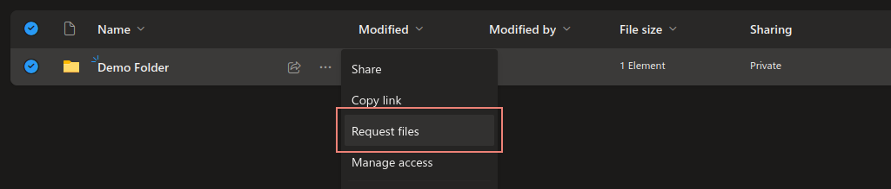

# Onedrive Request Uploader
This is a very small cli tool with which you can upload a file from your terminal directly to a sharepoint file request.

> **Important**
> This tool only for submitting to sharepoint file requests, and not ordinary file uploads or anything else.

## Purpose
On the Microsoft SharePoint, there is a feature called "Request files". With it, a user can create a link to a folder, with which anyone can upload files to it. This is often used to collect documents from various people, without trusting them to reach each others uploads.

Such an upload link can be created in most SharePoint using the right-click menu:


This results in a link that looks something like this:
```
https://tenant.sharepoint.com/:f:/g/personal/some_user/Ab_Hgz79wnd73t6dga6enga436dhjbj978eub168ghs1u
```

If this link is opened in a browser, it shows a page through which it is easy to upload files to said folder by selecting them.

> **Note** 
> The "Request file" feature is not present on every SharePoint or OneDrive instance. For example when using your private OneDrive account, this feature is not available.

This cli provides a method to upload files to such a request programatically or directly from the terminal. You can simply specify a file and a request url and the file is being uploaded swiftly.

## Usage
The usage of this cli is straight forward. Refer to the help page:

```
Usage: sharepoint-request-uploader [OPTIONS] <FILE> <URL>

Arguments:
  <FILE>  File to upload
  <URL>   File request url shared by the source

Options:
  -n, --name <NAME>          Name of the submitter (Firstname Lastname)
  -f, --filename <FILENAME>  Name of the file in the onedrive folder
  -h, --help                 Print help
  -V, --version              Print version
```

This page can be displayed using the `--help` option.
- `<FILE>` is the path to the file you want to upload.
- `<URL>` is the url that we talked about in [Purpose](#purpose).
- With the `--name` option you can enter a name which is shown to the owner of the request url. A firstname and lastname are both required. This defaults to `Unknown User`.
- With the `--filename` option you can specify the name the file will have in the OneDrive folder once uploaded. This defaults to the local name of the file. This is actually an option which is not available over the official upload webpage, so use it with care.

So this is how an example usage would look like:
```
sharepoint-request-uploader --name "Marcel D'Avis" --filename "file-from-marcel.txt" file.txt https://tenant.sharepoint.com/:f:/g/personal/some_user/Ab_Hgz79wnd73t6dga6enga436dhjbj978eub168ghs1u

```

## Installation
To install and use this application, you need to compile it from source. Technically, it should be able to compile on every platform, since it does not use any platform specific things. Note however, that I have only tested it on Linux.

To install it on Linux, make sure that you have a rust toolchain and the cargo build system installed correctly. Then, clone this repository:
```shell
git clone https://github.com/VirtCode/sharepoint-request-uploader
```

Now move into the new directory and build and install it via cargo:
```shell
cargo install --path .
```

Great! It should now be available in your path.

## Contributing
As you may see from the code, this tool is very simple and bare bones. However, if you need some extra functionality, better console output, or sleeker error handling, don't hesitate to contribute.

## License
This small project is licensed under the MIT license. Refer to the LICENSE.txt file for more information.